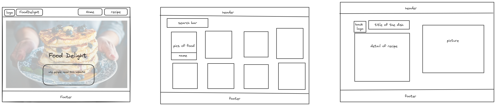

# zhe-chen-capstone-frontend

## Project Title

Recipe Delight

## Overview

Recipe Delight is a user-friendly website where food enthusiasts can explore, search, and learn from a vast collection of recipes. It offers detailed recipe instructions and allows users to search recipes by ingredients or categories.

### Problem

Finding recipes that match specific dietary preferences or ingredients on hand can be time-consuming. Many recipe sites are cluttered and difficult to navigate. Recipe Delight addresses this by providing a streamlined, easy-to-use interface that focuses on user experience and accessibility.

### User Profile

- Home cooks looking for recipe inspiration.
- Individuals with dietary restrictions searching for suitable recipes.
- Culinary enthusiasts who enjoy exploring new recipes and cuisines.

### Features

- **Search Functionality**: Allows users to search for recipes based on ingredients or recipe names.
- **Recipe Overview Page**: Displays recipes in a card format with essential details visible at a glance.
- **Detailed Recipe View**: Users can click on a recipe card to view detailed cooking instructions and ingredient lists.
- **Responsive Design**: Ensures that the website is accessible and functional on both desktops and mobile devices.

## Implementation

### Tech Stack

- **Frontend**: React, react-router, axios for building the user interface.
- **Backend**: Node.js with Express for handling API requests.(maynot use: knex and bcrypt for password)
- **Database**: mySQL for storing recipe data.
- **Styling**: CSS for responsive design.

### APIs

- Utilize an existing recipe API for the first phase of the project. If a suitable API is not found, consider developing a custom database.

### Sitemap

- **Home Page**: Introduction and basic information about the website.
- **Recipe Overview Page**: Search bar at the top; recipes displayed in a grid format.
- **Detailed Recipe Page**: Full recipe details when a recipe card is clicked.

### Mockups



### Data

The data schema will include fields for recipe name, ingredients, cooking instructions, and categories to facilitate easy searching and sorting.

### Endpoints

- **GET /recipes**: Fetch a list of recipes based on query parameters.
- **GET /recipes/:id**: Fetch detailed information about a specific recipe.

### Auth

- Initial implementation will not include user authentication. Consider adding user accounts and authentication in future phases to allow saving favorite recipes and custom settings.

## Roadmap

1. **Setup and Initial Configuration**: Set up the development environment, create project repositories, and configure basic server and client frameworks.
   Set up the frontend React project:
   -npx create-react-app  
   -npm install react-router-dom axios

   - Develop basic component structures such as HomePage, RecipeOverview, and RecipeDetail.

   Set up the backend Express project:
   -npx express-generator
   -npm install
   -npm install body-parser cors

   - Configure basic routes and middleware for API handling.

2. **API Integration**: Integrate with an external recipe API to fetch recipe data. (if there is no approprate api can use, then use MySQL to create database)

- Design the database schema in MySQL Workbench. Create tables for `recipes`, `users`, and `ratings`.

  - Implement the schema in MySQL:

    ```sql
    CREATE DATABASE my_recipe_db;
    USE my_recipe_db;

    CREATE TABLE recipes (
      recipe_id INT AUTO_INCREMENT PRIMARY KEY,
      title VARCHAR(255),
      ingredients TEXT,
      steps TEXT
    );

    CREATE TABLE users (
      user_id INT AUTO_INCREMENT PRIMARY KEY,
      username VARCHAR(255) UNIQUE,
      password_hash VARCHAR(255)
    );
    ```

  [nice to have,not must have
  CREATE TABLE ratings (
  rating_id INT AUTO_INCREMENT PRIMARY KEY,
  user_id INT,
  recipe_id INT,
  score INT,
  comment TEXT,
  FOREIGN KEY (user_id) REFERENCES users(user_id),
  FOREIGN KEY (recipe_id) REFERENCES recipes(recipe_id)
  );]

  - Populate the database with seed data for initial testing:
    sql
    INSERT INTO recipes (title, ingredients, steps) VALUES ('food names');
    INSERT INTO users (username, password) VALUES ('demo_user', 'password');

3. **Frontend Development**: Develop the Home Page, Recipe Overview Page, and Detailed Recipe Page.
4. **Backend Services**: Implement backend services to manage and serve recipe data.
5. **Testing and Debugging**: Test the website for functionality, usability, and responsiveness.

## Nice-to-haves

- **User Comments and Ratings**: Allow users to rate recipes and leave comments.
- **Recipe Sharing**: Enable users to share recipes on social media.
- **User Profile and Favorites**: Allow users to create profiles and save their favorite recipes.
